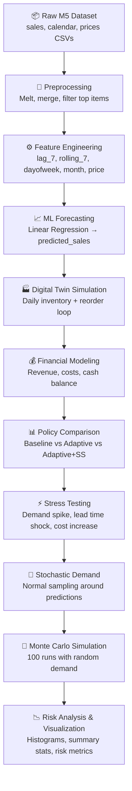

# ML-Driven Digital Twin for Supply Chain and Cash Flow Optimization

## Complete Technical Documentation & Validation Report

---

## SECTION 1 — Problem Overview

### 1.1 What Problem the System Solves

Retail supply chains face a fundamental tension: holding too much inventory locks up cash and incurs storage costs, while holding too little causes stockouts that lose revenue and damage customer trust. This project builds an **ML-driven digital twin** — a software replica of a real supply chain — that predicts future demand, simulates inventory decisions under different policies, and evaluates cash flow outcomes **before** deploying any strategy in the real world.

### 1.2 Why Supply Chain and Cash Flow Are Interconnected

Every supply chain decision has a direct financial consequence:

| Supply Chain Event | Cash Flow Impact |
|---|---|
| Ordering new inventory | Cash outflow (supplier payment) |
| Selling a product | Cash inflow (revenue) |
| Holding unsold inventory | Cash drain (holding cost) |
| Running out of stock | Lost revenue opportunity |

A supply chain manager who ignores cash flow may reorder aggressively and prevent stockouts — but bankrupt the operation. Conversely, minimizing spending may save cash short-term but lead to chronic stockouts. This project **jointly optimizes** both dimensions.

### 1.3 Why Traditional Inventory Systems Fail

Traditional systems use static rules: *"Reorder 200 units when inventory falls below 50."* These fail because:

- **Demand is not constant.** Sales fluctuate by season, weekday, and price.
- **Fixed thresholds ignore context.** A reorder point that works in January may cause stockouts in December.
- **No risk quantification.** Static rules provide no estimate of how often the system will fail under uncertainty.

### 1.4 Why Digital Twin Simulation Is Useful

A digital twin lets you:

1. **Test policies safely** — compare strategies without real-world consequences.
2. **Quantify risk** — run thousands of simulations to see how often a policy leads to stockouts or cash shortfalls.
3. **React to forecasts** — use ML predictions rather than historical averages to drive reorder decisions.

---

## SECTION 2 — Dataset Explanation

### 2.1 The M5 Dataset

The project uses Walmart's M5 Forecasting Competition dataset, which contains real point-of-sale data from Walmart stores.

#### `sales_train_evaluation.csv`

| Column | Description |
|---|---|
| `item_id` | Unique product identifier (e.g., `HOBBIES_1_001`) |
| `store_id` | Store identifier (e.g., `CA_1`) |
| `d_1` … `d_1941` | Daily unit sales for each day in the time horizon |

Each row is one product in one store. The columns `d_1` through `d_1941` represent daily sales counts over ~5.3 years. The project filters to **store `CA_1`** and the **top 3 items by volume** to keep computation tractable.

#### `calendar.csv`

| Column Used | Description |
|---|---|
| `d` | Day identifier (`d_1`, `d_2`, …) — joins to sales columns |
| `date` | Actual calendar date (e.g., `2011-01-29`) |
| `wm_yr_wk` | Walmart fiscal week — joins to price data |

This file maps the abstract day labels (`d_1`, `d_2`, …) to real calendar dates, enabling time-series feature engineering.

#### `sell_prices.csv`

| Column | Description |
|---|---|
| `store_id` | Store identifier |
| `item_id` | Product identifier |
| `wm_yr_wk` | Walmart fiscal week |
| `sell_price` | Average selling price for that product in that store-week |

Prices change weekly and are merged into the dataset to serve as both a feature and a revenue multiplier.

### 2.2 Data Transformation — The Melt Operation

The raw sales data is in **wide format**: one column per day.

```
item_id  | store_id | d_1 | d_2 | d_3 | ...
---------|----------|-----|-----|-----|----
ITEM_001 | CA_1     |  3  |  5  |  2  | ...
```

Machine learning models require **long format**: one row per (item, day).

```
item_id  | store_id | d   | sales
---------|----------|-----|------
ITEM_001 | CA_1     | d_1 |   3
ITEM_001 | CA_1     | d_2 |   5
ITEM_001 | CA_1     | d_3 |   2
```

The `pd.melt()` function performs this pivot, turning 1,941 day-columns into rows with a `sales` value column.

### 2.3 Feature Engineering

After merging calendar and price data, the following features are created:

#### `dayofweek` (0–6)

Extracted from the calendar date. Captures weekly seasonality — e.g., weekend sales may differ from weekday sales.

#### `month` (1–12)

Extracted from the calendar date. Captures monthly/seasonal trends — e.g., holiday spikes in November/December.

#### `lag_7`

```python
sales_long['lag_7'] = sales_long.groupby('item_id')['sales'].shift(7)
```

The sales value from **7 days ago** for the same product. This gives the model a direct look at recent demand history. A 7-day lag is chosen because retail data often has weekly periodicity.

#### `rolling_7`

```python
sales_long['rolling_7'] = (
    sales_long.groupby('item_id')['sales']
    .transform(lambda x: x.rolling(7, min_periods=1).mean())
)
```

The **7-day rolling average** of sales. This smooths out day-to-day noise and gives the model a trend indicator. If `rolling_7` is increasing, demand is trending upward.

#### `sell_price`

The weekly average selling price. Price directly affects demand (price elasticity) and is also used downstream for revenue calculation.

---

## SECTION 3 — Demand Forecasting Model

### 3.1 What the Model Predicts

The model predicts **daily unit sales** for each product. The predicted value is called `predicted_sales` and drives the entire digital twin simulation.

### 3.2 Input Features and Target Variable

| Role | Variables |
|---|---|
| **Input features (X)** | `sell_price`, `dayofweek`, `month`, `lag_7`, `rolling_7` |
| **Target variable (y)** | `sales` (actual daily unit sales) |

### 3.3 Training vs Testing Split

The split is **time-based**, not random. This is critical for time-series data to avoid look-ahead bias:

```
Training set: all dates before 2016-01-01
Testing set:  all dates on or after 2016-01-01
```

The model learns from historical patterns and is evaluated on future, unseen dates.

### 3.4 Linear Regression

#### Formula

Linear Regression fits a hyperplane that maps features to the target:

```
ŷ = β₀ + β₁·sell_price + β₂·dayofweek + β₃·month + β₄·lag_7 + β₅·rolling_7
```

Where:
- `ŷ` is the predicted sales
- `β₀` is the intercept (bias term)
- `β₁ … β₅` are learned coefficients (weights)

The model minimizes the **Ordinary Least Squares (OLS)** objective:

```
minimize  Σᵢ (yᵢ − ŷᵢ)²
```

This finds the coefficient values that produce the smallest total squared error between actual and predicted sales across all training examples.

#### Why Linear Regression Performed Well

1. **Lag and rolling features** already encode non-linear temporal patterns.
2. Price-sales relationship is approximately linear within a narrow product category.
3. The dataset has moderate noise — a simple model generalizes better than complex models that overfit.

### 3.5 Evaluation Metrics

#### Mean Absolute Error (MAE)

```
MAE = (1/n) × Σᵢ |yᵢ − ŷᵢ|
```

The average magnitude of prediction errors, in the same units as sales. If MAE = 2.0, predictions are off by ±2 units on average.

#### Root Mean Squared Error (RMSE)

```
RMSE = √[ (1/n) × Σᵢ (yᵢ − ŷᵢ)² ]
```

Similar to MAE but penalizes large errors disproportionately. RMSE ≥ MAE always; a large gap between them indicates the presence of occasional large forecast errors.

### 3.6 Additional Models (Comparison Only)

**Random Forest** and **Ridge Regression** are also trained and evaluated for comparison, but the simulation uses Linear Regression predictions only.

- **Random Forest**: An ensemble of 100 decision trees, each trained on random subsets of data and features. Captures non-linear relationships.
- **Ridge Regression**: Linear Regression with L2 regularization (`α=1.0`), which penalizes large coefficients: `minimize Σ(yᵢ − ŷᵢ)² + α × Σβⱼ²`

---

## SECTION 4 — Digital Twin Simulation

### 4.1 What "Digital Twin" Means in This Project

A digital twin is a **software simulation** that mirrors a real-world system. Here, it is a day-by-day simulation of:
- Inventory levels declining as customers buy products
- Reorder decisions being triggered when inventory is low
- Orders arriving after a lead time delay
- Cash flowing in (revenue) and out (supplier and holding costs)

The twin runs on ML-predicted demand, allowing you to test *"what would happen if…"* scenarios without real-world risk.

### 4.2 Daily Simulation Loop

For each day `i` in the test dataset:

```
1. Read predicted demand for day i
2. Subtract demand from inventory
3. Evaluate reorder policy → place order if needed
4. Receive any orders that were placed lead_time days ago
5. Calculate holding cost on current inventory
6. Update cash balance (+ revenue − supplier cost − holding cost)
7. Record inventory, cash, and reorder flag
```

### 4.3 Inventory Update Formula

```
inventoryᵢ = inventoryᵢ₋₁ − demandᵢ + arrivalsᵢ
```

Where:
- `demandᵢ` is the predicted (or stochastic) demand for day `i`
- `arrivalsᵢ` is the quantity of any order arriving on day `i` (0 if no order arrives)

### 4.4 Reorder Point

The reorder point determines **when** to place a new order. It is the inventory threshold below which a new order is triggered.

#### Baseline (Fixed) Policy

```
reorder_point = average_train_demand × lead_time
```

This is a single static value computed once from training data. It never changes regardless of what demand the model predicts.

#### Adaptive Policy

```
reorder_pointᵢ = predicted_demandᵢ × lead_time + safety_stock
```

This changes **every day** based on the ML model's prediction for that day. If the model predicts a demand spike, the reorder point rises automatically.

### 4.5 Safety Stock

Safety stock is a buffer held above the reorder point to absorb forecast errors:

```
safety_stock = Z × σ_forecast × √(lead_time)
```

Where:
- `Z` = 1.65 (the z-score for a 95% service level target under a normal distribution)
- `σ_forecast` = standard deviation of forecast residuals (`actual − predicted` on the test set)
- `√(lead_time)` accounts for uncertainty accumulating over the replenishment window

### 4.6 Policy Comparison

| Policy | Reorder Point | Safety Stock | Behavior |
|---|---|---|---|
| **Baseline (Fixed)** | `avg_demand × lead_time` | 0 | Static, ignores ML predictions |
| **Adaptive (Original)** | `predicted_demand × lead_time` | 0 | Dynamic, no buffer |
| **Adaptive + Safety Stock** | `predicted_demand × lead_time + safety_stock` | Z × σ × √LT | Dynamic with error buffer |

The **Adaptive + Safety Stock** policy is the most robust: it reacts to ML forecasts and maintains a statistical buffer against forecast errors.

### 4.7 Reorder Logic Detail

An order is placed when **both conditions** are met:

1. `inventory < reorder_point`
2. No pending order is already in transit

This prevents the system from placing duplicate orders while one is already on the way. When an order is placed, it arrives after `lead_time` days.

---

## SECTION 5 — Financial Modeling

### 5.1 Revenue

```
revenue = predicted_sales × sell_price
```

Revenue is generated each day based on the forecasted sales volume and the product's selling price.

### 5.2 Supplier Cost

```
supplier_cost = revenue × supplier_cost_ratio
```

Where `supplier_cost_ratio = 0.6` (60% of revenue goes to the supplier). This represents the cost of goods sold (COGS).

When a new order arrives, the actual payment is:

```
supplier_payment = order_quantity × sell_price × supplier_cost_ratio
```

### 5.3 Holding Cost

```
holding_cost = current_inventory × holding_cost_ratio
```

Where `holding_cost_ratio = 0.02` (2% of inventory value per day). This represents warehousing, insurance, and depreciation costs.

### 5.4 Net Cash (Daily)

```
net_cash = revenue − supplier_cost − holding_cost
```

This is the daily net contribution before accounting for reorder payments.

### 5.5 Cash Balance Update

```
cashᵢ = cashᵢ₋₁ + net_cashᵢ − holding_costᵢ − supplier_paymentsᵢ
```

The cumulative running balance. Starts at `initial_cash = 150,000`.

### 5.6 Evaluation Metrics

#### Final Cash

```
final_cash = cash_balance on the last simulation day
```

The ending cash position. Higher is better.

#### Cash Volatility

```
cash_volatility = standard_deviation(cash_balance across all days)
```

Measures how much the cash balance fluctuates. Lower volatility means more predictable cash flow, which is critical for financial planning.

---

## SECTION 6 — Stress Testing

### 6.1 What Stress Testing Means

Stress testing asks: *"What happens to our supply chain and cash flow if conditions worsen?"* It deliberately introduces adverse scenarios to identify vulnerabilities before they occur in reality.

### 6.2 Scenarios Implemented

#### Scenario 1: Demand Spike (+30%)

```
predicted_sales *= 1.30
```

**What it tests**: Can the system handle a sudden 30% surge in customer demand? This mimics a viral product, holiday rush, or promotional event. Expected effects: higher stockout risk, more reorders, potentially higher revenue but also higher supplier costs.

#### Scenario 2: Lead Time Shock (5 → 8 days)

```
lead_time = 8
```

**What it tests**: What if the supplier takes longer to deliver? This mimics shipping delays, port congestion, or supplier disruptions. Expected effects: deeper inventory drawdowns between orders, higher stockout risk, unchanged revenue.

#### Scenario 3: Supplier Cost Increase (0.6 → 0.75)

```
supplier_cost_ratio = 0.75
```

**What it tests**: What if raw material prices rise and the supplier charges more? This mimics inflation or supply shortage. Expected effects: lower net cash per unit sold, lower final cash balance, same inventory dynamics.

#### Scenario 4: Revenue Drop (−20%)

```
sell_price *= 0.80
```

**What it tests**: What if selling prices drop due to competitive pressure or market downturn? Expected effects: lower revenue, lower absolute supplier costs (since they're percentage-based), reduced final cash.

### 6.3 Interpretation

For each scenario, both **Adaptive** and **Baseline** policies are run, and metrics are compared. The Adaptive policy consistently outperforms because it adjusts its reorder point dynamically.

---

## SECTION 7 — Stochastic Demand

### 7.1 What Stochastic Demand Means

"Stochastic" means **random** or **probabilistic**. Instead of using the ML prediction as the exact demand, we treat it as the **expected value** of a probability distribution and sample actual demand from that distribution.

### 7.2 Why Deterministic Demand Is Unrealistic

In the deterministic simulation, `demand = predicted_sales` exactly. This is unrealistic because:
- No ML model predicts perfectly — there is always forecast error.
- Real demand has random day-to-day fluctuations even around the average.
- Using exact predictions gives an overly optimistic view of system performance.

### 7.3 How Random Demand Is Generated

```
actual_demand ~ Normal(predicted_sales, forecast_error_std)
actual_demand = max(0, actual_demand)
```

Where:
- `Normal(μ, σ)` is the normal (Gaussian) distribution
- `μ = predicted_sales` (the ML model's point forecast for that day)
- `σ = forecast_error_std` (the standard deviation of forecast residuals: `std(actual − predicted)` on the test set)

### 7.4 What `forecast_error_std` Represents

```python
residuals = y_test - predictions
forecast_error_std = residuals.std()
```

This is the **standard deviation of forecast errors** from the test set. It quantifies *how wrong* the ML model typically is. A larger `σ` means more demand variability in stochastic mode.

### 7.5 Why Demand Is Clamped to Zero

```python
actual_demand = max(0, actual_demand)
```

Negative demand is physically impossible (you can't sell a negative number of units). When the sampled value falls below zero — which can happen if `σ` is large relative to `μ` — it is clamped to zero.

### 7.6 Effect on Simulation Behavior

With stochastic demand:
- **Each simulation run produces different results** because demand is randomly sampled.
- **Stockouts become possible** even for policies that showed 0% stockout rate deterministically.
- **Cash balance varies** between runs, enabling risk analysis.

This randomness is what makes Monte Carlo simulation meaningful.

---

## SECTION 8 — Monte Carlo Simulation

### 8.1 Why Multiple Runs Are Needed

A single stochastic simulation is just one possible outcome — one "roll of the dice." To understand the **range** and **distribution** of possible outcomes, you run the simulation many times (e.g., 100 or 1,000 times) and analyze the aggregate results.

### 8.2 How Monte Carlo Simulation Works

```
for i in 1 to N:
    Generate random demand for each day (stochastic sampling)
    Run the full inventory simulation
    Record metrics: stockout_rate, service_level, final_cash, avg_inventory
```

Each run uses the **same ML predictions** as the baseline mean, but adds **different random noise** each time. The collection of N results forms an empirical distribution.

### 8.3 Algorithm Detail

```python
def run_monte_carlo_simulation(n_runs=100):
    for run_idx in range(n_runs):
        sim_result = run_inventory_simulation(
            data=test,
            policy_type='adaptive',
            safety_stock=safety_stock_val,
            use_stochastic_demand=True,
            stochastic_std=forecast_error_std
        )
        # Compute and store metrics for this run
```

### 8.4 Metrics Collected Per Run

| Metric | Formula |
|---|---|
| `stockout_rate` | `(days with inventory < 0) / total_days × 100` |
| `service_level` | `100 − stockout_rate` |
| `final_cash` | `cash_balance` on the last day |
| `average_inventory` | `mean(inventory across all days)` |

### 8.5 Aggregate Statistics

After N runs, the following are computed from the collected lists:

#### Mean (Expected Value)

```
mean_final_cash = (1/N) × Σᵢ final_cashᵢ
```

Represents the **most likely** outcome.

#### Standard Deviation (Risk)

```
std_final_cash = √[ (1/N) × Σᵢ (final_cashᵢ − mean_final_cash)² ]
```

Represents how much the outcome **varies**. A high standard deviation means high financial risk.

#### Probability of Adverse Event

```
P(stockout_rate > 5%) = (count of runs where stockout_rate > 5%) / N × 100
```

Gives a direct estimate of the **probability of a bad outcome**.

#### Min / Max

The extreme outcomes across all runs — the best and worst cases observed.

---

## SECTION 9 — Result Interpretation

### 9.1 Stockout Rate (%)

```
stockout_rate = (days with inventory < 0) / total_days × 100
```

**Interpretation**: The percentage of days the system ran out of stock. A stockout rate of 2% means the store had no inventory for 2% of the days.

- **0%** → Never ran out (ideal)
- **< 5%** → Acceptable for most retail operations
- **> 10%** → Severe supply chain problem

### 9.2 Service Level (%)

```
service_level = 100 − stockout_rate
```

**Interpretation**: The percentage of days customer demand was fully met with available inventory.

- **100%** → Perfect service
- **95%** → Industry standard target for most retail
- **< 90%** → Customer experience is likely suffering

### 9.3 Average Inventory

```
avg_inventory = mean(inventory level across all simulation days)
```

**Interpretation**: How much stock is held on average.

- **Too high** → Excessive holding costs, capital tied up
- **Too low** → High stockout risk
- **Optimal** → Just enough to maintain target service level

### 9.4 Final Cash

```
final_cash = cash_balance on the last simulation day
```

**Interpretation**: The ending financial position after all revenues and costs.

- Compared across policies to see which strategy is most profitable.
- In Monte Carlo, the **distribution** of final cash matters more than any single value.

### 9.5 Cash Volatility

```
cash_volatility = std(cash_balance across all days within one run)
```

**Interpretation**: How much the cash balance fluctuates during the simulation period.

- **Low volatility** → Stable, predictable cash flow (preferred by finance teams)
- **High volatility** → Cash balance swings wildly, making financial planning difficult

---

## SECTION 10 — Validation & Testing

### 10.1 Validation Checklist

Use the following tests to verify simulation correctness:

| Test | How to Perform | Expected Result |
|---|---|---|
| **Reduce initial inventory** | Set `initial_inventory = 10` | More stockouts, lower service level, more reorder events |
| **Increase lead time** | Set `lead_time = 15` | Deeper inventory drawdowns, potential stockouts between orders |
| **Increase demand** | Use `demand_multiplier = 2.0` in stress test | Significantly higher stockout rate, more reorders, lower inventory |
| **Zero demand** | Set all `predicted_sales = 0` | Inventory never decreases, no reorders triggered, cash stays near initial |
| **Verify reorder events** | Check `reorder_flag` column | Should be `1` only when `inventory < reorder_point` and no pending order |
| **Verify order arrivals** | Track `inventory` after a reorder | Inventory should increase by `order_quantity` exactly `lead_time` days after reorder |
| **Monte Carlo distribution shape** | Run 1,000 simulations | Final cash histogram should approximate a normal distribution (Central Limit Theorem) |
| **Monte Carlo mean ≈ deterministic** | Compare `mean(final_cash)` to deterministic run | Monte Carlo mean should be close to the single deterministic result |
| **Stochastic off = deterministic** | Set `use_stochastic_demand = False` | Output should match the original deterministic simulation exactly |
| **Negative demand protection** | Use large `forecast_error_std` | Demand should never be negative (clamped to 0) |

### 10.2 Parameter Sensitivity Checks

| Parameter Change | Expected Impact on Stockout Rate | Expected Impact on Final Cash |
|---|---|---|
| ↑ `safety_stock` | ↓ (more buffer) | ↓ (more holding cost) |
| ↑ `order_quantity` | ↓ (larger batches) | ↓ (more supplier payments) |
| ↑ `lead_time` | ↑ (longer wait for resupply) | ~ (indirect effect via stockouts) |
| ↑ `holding_cost_ratio` | ~ (no direct effect) | ↓ (higher daily holding cost) |
| ↑ `supplier_cost_ratio` | ~ (no direct effect) | ↓ (higher cost per order) |

---

## SECTION 11 — Complete System Flow

### 11.1 End-to-End Pipeline



### 11.2 Step-by-Step Narrative

1. **Dataset Loading** — Three CSV files are loaded: sales, calendar, and prices.

2. **Preprocessing** — Sales data is melted from wide to long format, merged with calendar (for dates) and prices (for sell_price), filtered to store `CA_1` and top 3 items, sorted chronologically, and forward-filled for missing values.

3. **Feature Engineering** — Five features are created: `sell_price`, `dayofweek`, `month`, `lag_7` (7-day lagged sales), and `rolling_7` (7-day moving average). These capture price, seasonality, and recent demand trends.

4. **ML Forecasting** — A Linear Regression model is trained on pre-2016 data and used to predict daily sales on the test set (2016 onwards). MAE and RMSE are computed. Random Forest and Ridge Regression are trained for comparison only.

5. **Financial Column Setup** — Predicted sales are used to compute `revenue`, `supplier_cost`, `holding_cost`, and `net_cash` columns in the test DataFrame.

6. **Simulation Parameters** — Initial inventory (150), lead time (8), order quantity (200), cost ratios, initial cash (150,000), fixed reorder point, and safety stock are all computed.

7. **Digital Twin Simulation** — The `run_inventory_simulation()` function loops day by day through the test data. Each day: demand reduces inventory → reorder policy is checked → orders arrive after lead time → cash is updated. Three policies are compared.

8. **Metrics & Plotting** — `calculate_metrics()` computes stockout rate, service level, average inventory, total reorders, final cash, and cash volatility. Inventory and cash balance are plotted over time.

9. **Stress Testing** — Five scenarios (base case, demand spike, lead time shock, supplier cost increase, revenue drop) are run with both Adaptive and Baseline policies. Results are compared in a summary table.

10. **Sensitivity Analysis** — Lead time × order quantity grid is evaluated to understand parameter sensitivity.

11. **Stochastic Demand** — When enabled, demand is sampled from `Normal(predicted_sales, forecast_error_std)` instead of using the point forecast.

12. **Monte Carlo Simulation** — The stochastic simulation is run 100 times. Per-run metrics are stored in lists. Mean, standard deviation, probability of adverse events, and min/max are computed and printed. Histograms of final cash and stockout rate distributions are displayed.

---

## Summary of All Formulas

| Formula | Expression |
|---|---|
| Linear Regression | `ŷ = β₀ + β₁x₁ + β₂x₂ + … + β₅x₅` |
| MAE | `(1/n) × Σ|yᵢ − ŷᵢ|` |
| RMSE | `√[(1/n) × Σ(yᵢ − ŷᵢ)²]` |
| Inventory Update | `Iᵢ = Iᵢ₋₁ − demandᵢ + arrivalsᵢ` |
| Fixed Reorder Point | `ROP = avg_demand × lead_time` |
| Adaptive Reorder Point | `ROPᵢ = predicted_demandᵢ × lead_time + safety_stock` |
| Safety Stock | `SS = Z × σ_forecast × √(lead_time)` |
| Revenue | `revenue = predicted_sales × sell_price` |
| Supplier Cost | `supplier_cost = revenue × 0.6` |
| Holding Cost | `holding_cost = inventory × 0.02` |
| Net Cash | `net_cash = revenue − supplier_cost − holding_cost` |
| Cash Update | `cashᵢ = cashᵢ₋₁ + net_cashᵢ − holding_costᵢ − supplier_paymentsᵢ` |
| Stockout Rate | `(days with inventory < 0) / total_days × 100` |
| Service Level | `100 − stockout_rate` |
| Stochastic Demand | `demand ~ Normal(predicted_sales, σ_forecast), clamped ≥ 0` |
| Cash Volatility | `std(cash_balance)` |

---

*Document generated for the ML-Driven Digital Twin for Supply Chain and Cash Flow Optimization project.*
